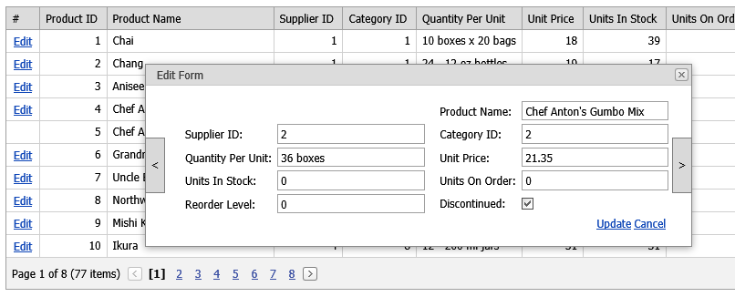

# Grid View for ASP.NET Web Forms - How to show the Next/Previous buttons on the popup edit form
<!-- run online -->
**[[Run Online]](https://codecentral.devexpress.com/t320598/)**
<!-- run online end -->

This example demonstrates how to specify a column's `EditItemTempalate` property and add custom buttons to the template.

## Files to Review

* [Default.aspx](./CS/Default.aspx) (VB: [Default.aspx](./VB/Default.aspx))
* [Default.aspx.cs](./CS/Default.aspx.cs) (VB: [Default.aspx.vb](./VB/Default.aspx.vb))
